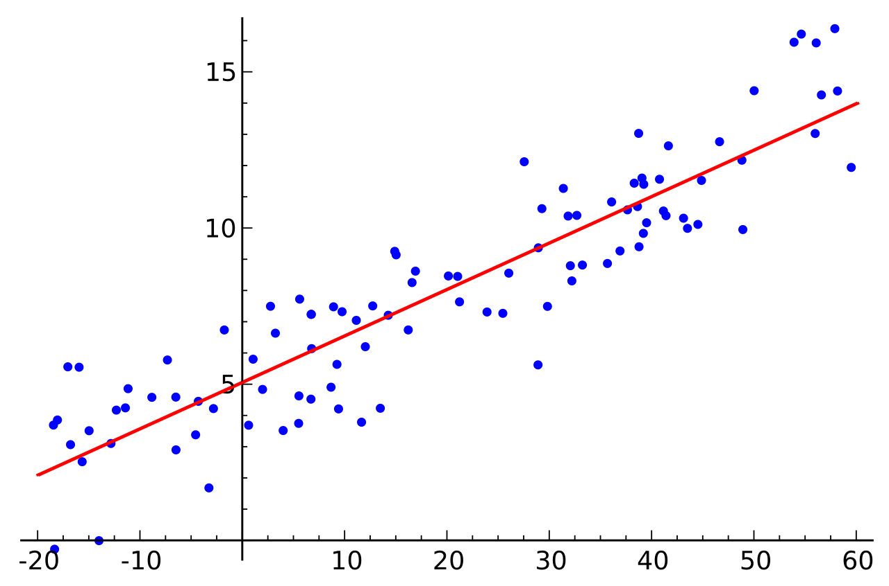
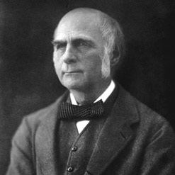
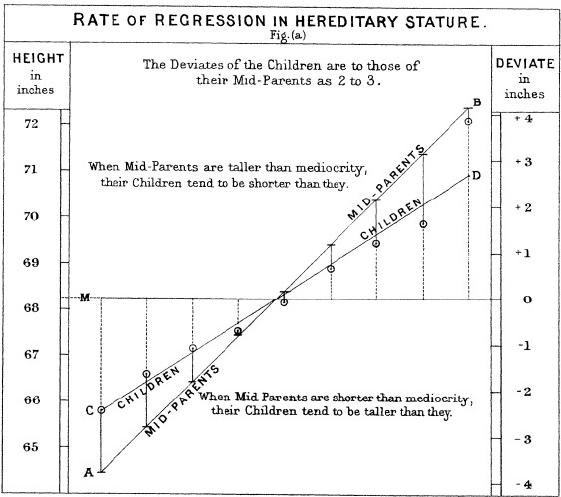

```{r setup, include=FALSE}
knitr::opts_chunk$set(echo = TRUE, warning = F)
img_path <- "regfigs/"
```

## Introduction to regression
In data science applications, it is very common to be interested in the relationship between two or more variables. For example, we we might want to use a data-driven approach that examines the relationship between baseball player statistics and success to guide the building of a baseball team with a limited budget.  Before delving into this more complex example, we introduce necessary concepts needed to understand regression. 

## Introduction to regression
In statistical modeling, regression analysis is a set of statistical processes for estimating the relationships between a dependent variable (often called the 'outcome' or 'response' variable, or a 'label' in machine learning parlance) and one or more independent variables (often called 'predictors', 'covariates', 'explanatory variables' or 'features'). The most common form of regression analysis is **linear regression**, in which one finds the line (or a more complex linear combination) that most closely fits the data according to a specific mathematical criterion.

## Introduction to regression
Consider the model function 
$$y_i=\alpha+\beta x_i,$$
which describes a line with slope $\beta$ and $y$-intercept $\alpha$. 

## Introduction to regression
In general such a relationship may not hold exactly for the largely unobserved population of values of the independent and dependent variables; we call the unobserved deviations from the above equation the errors. Suppose we observe $n$ data pairs and call them 
$${(x_i, y_i), i = 1, ..., n}.$$ 
We can describe the underlying relationship between $y_i$ and $x_i$ involving this error term $\epsilon_i$ by
$$y_i=\alpha+\beta x_i+\epsilon_i.$$
This relationship between the true (but unobserved) underlying parameters $\alpha$ and $\beta$ and the data points is called a **linear regression model**.

## Introduction to regression


## Introduction to regression
The goal is to find estimated values $\hat\alpha$ and $\hat\beta$ for the parameters $\alpha$ and $\beta$ which would provide the "best" fit in some sense for the data points. Here, the "best" fit will be understood as in the least-squares approach: a line that minimizes the sum of squared residuals 
$$\min_{\alpha,\beta}Q(\alpha,\beta)=\sum_{i=1}^n \epsilon_i^2 = \underset{\alpha,\beta}\inf\left\{\sum_{i=1}^n(y_i-\alpha-\beta)^2\right\}.$$

## Introduction to regression


## Introduction to regression
Now, we can extend this to include multiple ($p$) predictors: 
$$y_i=x_{i1}\beta_1+\ldots+x_{ip}\beta_p+\epsilon_i=\sum_{j=1}^{p}x_{ij}\beta_j+\epsilon_i.$$

## Introduction to regression
In addition we can use matrices to represent our model. Assume ${\bf y}=(y_1, y_2, \ldots, y_n)$ with a matrix of predictors ${\bf X}$ and coefficient vector $\beta$ ($n\times 1$ vector). Then we can define our regression equation as: $${\bf y}=X\beta+\epsilon,$$
where $\epsilon\sim N({\bf 0},\sigma^2 I_n)$ and $I_n$ is an identity matrix with dimension $n$.

## Introduction to regression
Minimizing the least squared error is can be represented by
$$\hat\beta=\underset{\beta}\inf\left\{\sum_{i=1}^{n}(y_i-\sum_{j=1}^{p}x_{ij}\beta_j)^2\right\}=\underset{\beta}\inf\left\{({\bf y}-{\bf X}\beta)'({\bf y}-{\bf X}\beta)\right\}$$

## The regression fallacy

Wikipedia defines the _sophomore slump_ as: \vskip .2in

> A sophomore slump or sophomore jinx or sophomore jitters refers to an instance in which a second, or sophomore, effort fails to live up to the standards of the first effort. It is commonly used to refer to the apathy of students (second year of high school, college or university), the performance of athletes (second season of play), singers/bands (second album), television shows (second seasons) and movies (sequels/prequels).

## The regression fallacy

In Major League Baseball, the rookie of the year (ROY) award is given to the first-year player who is judged to have performed the best. The _sophmore slump_ phrase is used to describe the observation that ROY award winners don't do as well during their second year. For example, this Fox Sports article^[http://www.foxsports.com/mlb/story/kris-bryant-carlos-correa-rookies-of-year-award-matt-duffy-francisco-lindor-kang-sano-120715] asks "Will MLB's tremendous rookie class of 2015 suffer a sophomore slump?".

## The regression fallacy
Does the data confirm the existence of a sophomore slump? Let's take a look. Examining the data for batting average, we see that this observation holds true for the top performing ROYs:

<!--The data is available in the Lahman library, but we have to do some work to create a table with the statistics for all the ROY. First we create a table with player ID, their names, and their most played position.-->

```{r, echo=FALSE, message=FALSE, warning=FALSE}
library(tidyverse)
library(Lahman)
playerInfo <- Fielding %>% 
  group_by(playerID) %>% 
  arrange(desc(G)) %>%
  slice(1) %>%
  ungroup %>% 
  left_join(People, by="playerID") %>% 
  select(playerID, nameFirst, nameLast, POS)
```


<!--
Now, we will create a table with only the ROY award winners and add their batting statistics. We filter out pitchers, since pitchers are not given awards for batting and we are going to focus on offense. Specifically, we will focus on batting average since it is the summary that most pundits talk about when discussing the sophomore slump:
-->

```{r, echo=FALSE}
ROY <- AwardsPlayers %>%
  filter(awardID == "Rookie of the Year") %>% 
  left_join(playerInfo, by="playerID") %>%
  rename(rookie_year = yearID) %>%
  right_join(Batting, by="playerID") %>% 
  mutate(AVG = H/AB) %>% 
  filter(POS != "P")
```

<!--
We also will keep only the rookie and sophomore seasons and remove players that did not play sophomore seasons:
-->
```{r, echo=FALSE}
ROY <- ROY %>%  
  filter(yearID == rookie_year | yearID == rookie_year+1) %>% 
  group_by(playerID) %>% 
  mutate(rookie = ifelse(yearID == min(yearID), "rookie", "sophomore")) %>%
  filter(n() == 2) %>% 
  ungroup %>%
  select(playerID, rookie_year, rookie, nameFirst, nameLast, AVG) 
```
<!--
Finally, we will use the `spread` function to have one column for the rookie and sophomore years batting averages:
-->

```{r, echo=FALSE}
ROY <- ROY %>% spread(rookie, AVG) %>% arrange(desc(rookie)) 
tmp <- ROY %>% slice(1:5) %>%
  select(nameFirst, nameLast, rookie_year, rookie, sophomore)
if(knitr::is_html_output()){
  knitr::kable(tmp, "html") %>%
    kableExtra::kable_styling(bootstrap_options = "striped", 
                              full_width = FALSE)
} else{
  knitr::kable(tmp, "latex", booktabs = TRUE) %>%
    kableExtra::kable_styling(font_size = 8)
}
```

In fact, the proportion of players that have a lower batting average their sophomore year is `r mean(ROY$sophomore - ROY$rookie <= 0)`.


## The regression fallacy
So is it "jitters" or "jinx"? To answer this question, let's turn our attention to all players that played the 2013 and 2014 seasons and batted more than 130 times (minimum to win Rookie of the Year). 

<!--We perform similar operations to what we did above: -->

```{r, echo=FALSE , message=FALSE, warning=FALSE}
two_years <- Batting %>% 
  filter(yearID %in% 2013:2014) %>% 
  group_by(playerID, yearID) %>%  
  filter(sum(AB) >= 130) %>% 
  summarize(AVG = sum(H)/sum(AB)) %>% 
  ungroup %>% 
  spread(yearID, AVG) %>% 
  filter(!is.na(`2013`) & !is.na(`2014`)) %>%
  left_join(playerInfo, by="playerID") %>% 
  filter(POS!="P") %>% 
  select(-POS) %>%
  arrange(desc(`2013`)) %>% 
  select(nameFirst, nameLast, `2013`, `2014`)
```  

The same pattern arises when we look at the top performers: batting averages go down for most of the top performers.

```{r, echo=FALSE}
tmp <- two_years %>% slice(1:5) 
if(knitr::is_html_output()){
  knitr::kable(tmp, "html") %>%
    kableExtra::kable_styling(bootstrap_options = "striped", full_width = FALSE)
} else{
  knitr::kable(tmp, "latex", booktabs = TRUE) %>%
    kableExtra::kable_styling(font_size = 8)
}
```
But these are not rookies! 

## The regression fallacy
Also, look at what happens to the worst performers of 2013:

```{r, echo=FALSE}
tmp <- arrange(two_years, `2013`) %>% slice(1:5)
if(knitr::is_html_output()){
  knitr::kable(tmp, "html") %>%
    kableExtra::kable_styling(bootstrap_options = "striped", full_width = FALSE)
} else{
  knitr::kable(tmp, "latex", booktabs = TRUE) %>%
    kableExtra::kable_styling(font_size = 8)
}
```

Their batting averages mostly go up! 

## The regression fallacy
Is this some sort of reverse sophomore slump? It is not. There is no such thing as the sophomore slump. This is all explained with a simple statistical fact: the correlation for performance in two separate years is high, but not perfect:

```{r regression-fallacy, echo=FALSE, fig.height=3, fig.width=3, out.width="40%", fig.align='center'}
qplot(`2013`, `2014`, data = two_years)
```

## The regression fallacy
The correlation is `r cor(two_years$"2013",two_years$"2014")` and
the data look very much like a bivariate normal distribution, which means we predict a 2014 batting average $Y$ for any given player that had a 2013 batting average $X$ with:

$$ \frac{Y - .255}{.032} = 0.46 \left( \frac{X - .261}{.023}\right) $$

Because the correlation is not perfect, regression tells us that, on average, expect high performers from 2013 to do a bit worse in 2014. It's not a jinx; it's just due to chance. The ROY are selected from the top values of $X$ so it is expected that $Y$ will **regress to the mean**.


## Case study: is height hereditary?
Lets take a look that the datasetfrom which regression was born:

Francis Galton^[https://en.wikipedia.org/wiki/Francis_Galton] studied the variation and heredity of human traits. Among many other traits, Galton collected and studied height data from families to try to understand heredity. While doing this, he developed the concepts of correlation and regression, as well as a connection to pairs of data that follow a normal distribution. 

\center
{ width=25% }


## Case study: is height hereditary?
A very specific question Galton tried to answer was: how well can we predict a child's height based on the parents' height? The technique he developed to answer this question was called **regression**!  \vskip .2in

__Historical note__: Galton made important contributions to statistics and genetics, but he was also one of the first proponents of eugenics, a scientifically flawed philosophical movement favored by many biologists of Galton's time but with horrific historical consequences. You can read more about it here: [https://pged.org/history-eugenics-and-genetics/](https://pged.org/history-eugenics-and-genetics/).

## Case study: is height hereditary?

We have access to Galton's family height data through the __HistData__ package. To imitate Galton's analysis, we will create a dataset with the heights of fathers and a randomly selected son of each family: 

\small
```{r, message=FALSE, warning=FALSE, echo=TRUE}
library(tidyverse)
library(HistData)
data("GaltonFamilies")

set.seed(1983)
galton_heights <- GaltonFamilies %>%
  filter(gender == "male") %>%
  group_by(family) %>%
  sample_n(1) %>%
  ungroup() %>%
  select(father, childHeight) %>%
  rename(son = childHeight)
```

## Case study: is height hereditary?

Suppose we were asked to summarize the father and son data. Since both distributions are well approximated by the normal distribution, we could use the two averages and two standard deviations as summaries:

```{r, echo=TRUE}
galton_heights %>% 
  summarize(mean(father), sd(father), mean(son), sd(son))
```

However, this summary fails to describe an important characteristic of the data: the trend that the taller the father, the taller the son. 

## Case study: is height hereditary?

```{r scatterplot, fig.height = 3, fig.width = 3, out.width="40%", echo=TRUE, fig.align="center"}
galton_heights %>% ggplot(aes(father, son)) + 
  geom_point(alpha = 0.5)
```


## Case study: is height hereditary?
The correlation between father and son's heights is:

```{r}
galton_heights %>% 
    summarize(r = cor(father, son)) %>% 
    pull(r)
```

<!--
## Case study: is height hereditary?
\center
 
-->

## Diversion: Maximum Likelihood for a Normal mean
Assume ${\bf x}=(x_1, x_2, \ldots, x_N)$, where $x_i$s are independent from a Normal($\mu,\sigma^2$) distribution, where ${\bf x}$ is observed and $\sigma^2$ is known. Then 
$$L(\mu|{\bf x})=\left\{\frac{1}{2\pi\sigma^2}\right\}^{N/2}exp\left\{-\frac{1}{2\sigma^2}\sum_{i=1}^{N}(x_i-\mu)^2\right\}$$\pause
Notice we can maximize $L(\mu|{\bf x})$ by minimizing $\sum_{i=1}^{N}(x_i-\mu)^2$ for $\mu$.

## Diversion: Maximum Likelihood for a Normal mean
Note the following:
\[
\begin{aligned}
\sum_{i=1}^{N}(x_i-\mu)^2 &= \sum_{i=1}^{N}(x_i^2-2\mu x_i+\mu^2)\\\pause
  &= \sum_{i=1}^{N}x_i^2-2\mu\sum_{i=1}^{N}x_i+N\mu^2\\\pause
\end{aligned}
\]

## Diversion: Maximum Likelihood for a Normal mean
therefore:
\[
\begin{aligned}
\frac{\partial}{\partial\mu} &=-2\sum x_i+2N\hat\mu\stackrel{set}{=}0\\\pause
  &\Rightarrow N\hat\mu = \sum x_i\\\pause
  &\Rightarrow \hat\mu = \frac{\sum x_i}{N}
\end{aligned}
\]


## Diversion: Maximum Likelihood for Regression
Assume ${\bf y}=(y_1, y_2, \ldots, y_N)$ with a matrix of predictors ${\bf X}$ and coefficient vector $\beta$ ($n\times 1$ vector). Then we can define our regression equation as: $${\bf y}=X\beta+\epsilon,$$
where $\epsilon\sim N({\bf 0},\sigma^2 I_N)$ and $I_N$ is an identity matrix with dimension $N$.

## Diversion: Maximum Likelihood for Regression
Now, extending the Normal mean MLE to regression, we note that $$\sum_{i=1}^{N}(y_i-x_1\beta_1-\ldots-x_N\beta_N)^2=({\bf y}-{\bf X}\beta)'({\bf y}-{\bf X}\beta),$$\pause
so
$$L(\beta|{\bf X},{\bf y})=\left\{\frac{1}{2\pi\sigma^2}\right\}^{N/2}exp\left\{-\frac{1}{2\sigma^2}({\bf y}-{\bf X}\beta)'({\bf y}-{\bf X}\beta)\right\}.$$
Thus maximizing the Likelihood is equivalent to minimizing $({\bf y}-{\bf X}\beta)'({\bf y}-{\bf X}\beta)$, or in other words, minimizing the sum of the squared error!

## Diversion: Maximum Likelihood for Regression
Note 
$$({\bf y}-{\bf X}\beta)'({\bf y}-{\bf X}\beta)={\bf y}'{\bf y}-2\beta'{\bf X}'{\bf y}+\beta'{\bf X}'{\bf X}\beta,$$\pause
and therefore
\[
\begin{aligned}
\frac{\partial}{\partial\beta} &=-2{\bf X}'{\bf y}+2{\bf X}'{\bf X}\hat\beta \stackrel{set}{=}0\\\pause
  &\Rightarrow {\bf X'X}\hat\beta = {\bf X'y}\\\pause
  &\Rightarrow {\bf (X'X)}^{-1}{\bf X'X}\hat\beta = {\bf (X'X)}^{-1}{\bf X'y}\\\pause
  &\Rightarrow \hat\beta = {\bf (X'X)}^{-1}{\bf X'y}
\end{aligned}
\]

## Diversion: Maximum Likelihood for Regression
Now note: 
\[
\begin{aligned}
E[\hat\beta] &= E[{\bf (X'X)}^{-1}{\bf X'y}] \\\pause
  &= {\bf (X'X)}^{-1}{\bf X'}E[{\bf y}]\\\pause
  &= {\bf (X'X)}^{-1}{\bf X'X\beta}\\\pause
  &= \beta
\end{aligned}
\]

## Diversion: Maximum Likelihood for Regression
And, remembering that $$Var[{\bf Ay}]={\bf A}\{Var[{\bf y}]\}{\bf A'},$$ 
so therefore,
\[
\begin{aligned}
Var[\hat\beta] &= Var[{\bf (X'X)}^{-1}{\bf X'y}] \\\pause
  &= {\bf (X'X)}^{-1}{\bf X'}\{Var[{\bf y}]\}{\bf X}{\bf (X'X)}^{-1}\\\pause
  &= {\bf (X'X)}^{-1}{\bf X'}\{\sigma^2 I_N\}{\bf X}{\bf (X'X)}^{-1}\\\pause
  &= \sigma^2{\bf (X'X)}^{-1}{\bf X'X}{\bf (X'X)}^{-1}\\\pause
  &= \sigma^2{\bf (X'X)}^{-1}.
\end{aligned}
\]

Typically, we use the following to estimate $\sigma^2$:
$$\hat\sigma^2=\frac{1}{N-p-1}({\bf y}-X{\bf\hat\beta})'({\bf y}-X{\bf\hat\beta})$$

## Diversion: Maximum Likelihood for Regression
So we can conduct a hypothesis test $\beta$, where $H_0: \beta_j=0$ versus $H_a: \beta_j \ne 0$ using the statistic: 

$$t_{\beta_j} = \frac{\hat\beta_j}{\hat\sigma\sqrt{v_{jj}}},$$ 
where $v_{jj}$ is the $j$th diagonal element of ${\bf V={\bf (X'X)}^{-1}}$. Under $H_0$, $t_{\beta_j}$ will follow a $t$ distribution with $N-p-1$ degrees of freedom.


## Case study: is height hereditary?
Thus using our estimator for ${\bf\beta}$: <!-- and $\hat\sigma^2$: -->

$${\bf\hat\beta} = (X'X)^{-1}X'{\bf y}$$ <!--, Var({\bf\hat\beta})=\sigma^2(X'X)^{-1}, \mbox{ and }$$ --> <!--$$\hat\sigma^2=\frac{1}{N-p-1}({\bf y}-X{\bf\hat\beta})'({\bf y}-X{\bf\hat\beta})$$ -->
```{r}
X <- cbind(1,galton_heights$father)
y <- galton_heights$son
beta_hat <- solve(t(X)%*%X)%*%t(X)%*%y
beta_hat
```

## Case study: is height hereditary?
Predicted values can be obtained by: $\hat y = X\hat\beta$, In R: 
\scriptsize
```{r, ,fig.height = 3, fig.width = 3, out.width="40%", fig.align="center"}
y_hat <- X %*% beta_hat

galton_heights %>% ggplot(aes(father, son)) +
  geom_point(alpha = 0.5) +
  geom_point(aes(y = y_hat), col = "red") +
  geom_abline(slope = 1, intercept = 0)
```

## Case study: is height hereditary?
\center
{width=70%}


## Case study: is height hereditary?
For hypothesis testing we can optain a standard error: 
$$SE({\hat\beta_i})=\hat\sigma \sqrt{v_{ii}},$$ where $v_{ii}$ is the $i$th diagonal element of $(X'X)^{-1}$, and $$\hat\sigma^2=\frac{1}{N-p-1}({\bf y}-X{\bf\hat\beta})'({\bf y}-X{\bf\hat\beta})$$

```{r}
N <- length(y)
p <- length(beta_hat)
sigma2_hat <- 1 / (N - p - 1) * 
  t(y - X %*% beta_hat) %*% (y - X %*% beta_hat)
V <- solve(t(X) %*% X)
Z2 <- beta_hat[2] / sqrt(sigma2_hat * V[2, 2])
Z2
```

## Case study: is height hereditary?

In R, we can obtain the least squares estimates using the `lm` function. To fit the model:
$$
Y_i = \beta_0 + \beta_1 x_i + \varepsilon_i
$$

with $Y_i$ the son's height and $x_i$ the father's height, we can use this code to obtain the least squares estimates: 
```{r, echo=TRUE}
fit <- lm(son ~ father, data = galton_heights)
fit$coef
```

## Case study: is height hereditary?
The object `fit` includes more information about the fit. We can use the function `summary` to extract more of this information:
\scriptsize
```{r}
summary(fit)
```

## Case study: is height hereditary?
We can use __ggplot2__ layers to plot $\hat{Y}$ with its confidence intervals:

```{r father-son-regression, fig.height = 3, fig.width = 3, out.width="40%", fig.align="center",message=FALSE}
galton_heights %>% ggplot(aes(son, father)) +
  geom_point() +
  geom_smooth(method = "lm")
```

## Case study: is height hereditary?
The R function `predict` takes an `lm` object as input and returns the prediction. If requested, the standard errors and other information from which we can construct confidence intervals is provided:

\scriptsize
```{r father-son-predictor}
fit <- galton_heights %>% lm(son ~ father, data = .) 

y_hat <- predict(fit, se.fit = TRUE)

names(y_hat)
```

## Linear regression in the tidyverse (the broom package)

The __broom__ package has three main functions, all of which extract information from the object returned by `lm` and return it in a __tidyverse__ friendly data frame. These functions are `tidy`, `glance`, and `augment`. The `tidy` function returns estimates and related information as a data frame:

```{r}
library(broom)
fit <- galton_heights %>% lm(son ~ father, data = .)
tidy(fit)
```

## Linear regression in the tidyverse (the broom package)
We can add other important summaries, such as confidence intervals:
\scriptsize
```{r}
tidy(fit, conf.int = TRUE)
```

## Linear regression in the tidyverse (the broom package)
Because the outcome is a data frame, we can immediately use it with `summarize` to string together the commands that produce the table we are after. Because a data frame is returned, we can filter and select the rows and columns we want, which facilitates working with __ggplot2__:

## Linear regression in the tidyverse (the broom package)
\scriptsize
```{r do-tidy-example,fig.height = 3, fig.width = 3, out.width="40%", fig.align="center",message=FALSE} 

galton_heights %>% 
    lm(son ~ father, data = .) %>% 
    tidy(conf.int = TRUE) %>%
    filter(term == "father") %>%
    select(estimate, conf.low, conf.high) # %>%
    #ggplot(aes(x = estimate, xmin = conf.low, xmax = conf.high, y=1)) +
    #geom_errorbar() +
    #geom_point()

```

## Linear regression in the tidyverse (the broom package)
The other functions provided by __broom__, `glance`, and `augment`, relate to model-specific and observation-specific outcomes, respectively. Here, we can see the model fit summaries `glance` returns:
\tiny
```{r}
glance(fit)
```


## Session Info
\tiny
```{r session}
sessionInfo()
```
