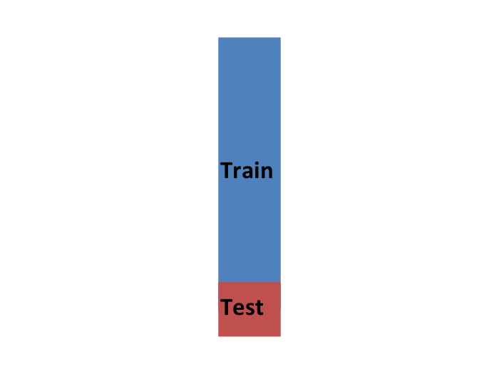
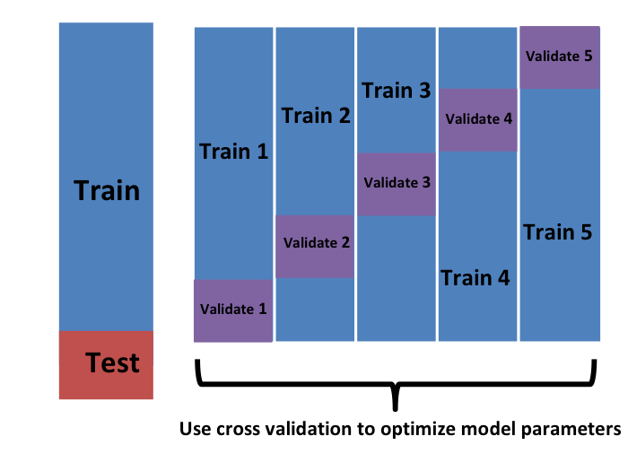
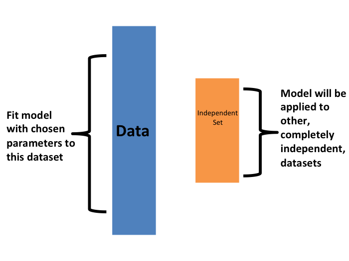

```{r setup, include=FALSE}
knitr::opts_chunk$set(echo = TRUE)
library(caret)
library(tidyverse)
library(gam)
img_path <- "cvfigs/"
```

## Cross-validation 
In our LASSO analyses, we introduced and used **cross-validation** to select an optimal value for $\lambda$. 

Cross-validation is one of the most important ideas in machine learning. Here we focus on the conceptual and mathematical aspects. We will describe how to implement cross validation in practice in later examples. 

## Cross-validation example
To motivate the concept, we will introduce an actual machine learning algorithm: k-nearest neighbors (kNN).
\small
```{r mnist-27-data, warning=FALSE, message=FALSE, fig.height = 3, fig.width = 6, out.width="75%", fig.align="center"}
library(dslabs); data("mnist_27")
mnist_27$test %>% ggplot(aes(x_1, x_2, color = y)) + geom_point()
```

<!--
## Cross-validation example: k-nearest neighbors (kNN)
With k-nearest neighbors (kNN) we estimate the conditional probability function: 
$$p(x_1, x_2) = \mbox{Pr}(Y=1 \mid X_1=x_1 , X_2 = x_2).$$
First we define the distance between each of the observations. Then, for any point $(x_1,x_2)$ for which we want an estimate of $p(x_1, x_2)$, we look for the $k$ nearest points to $(x_1,x_2)$ and then take an average of the 0s and 1s associated with these points. We refer to the set of points used to compute the average as the _neighborhood_. This gives us an estimate $\hat{p}(x_1,x_2)$.
-->

## Cross-validation example: k-nearest neighbors (kNN)
\center
{width=85%}

## Cross-validation example: k-nearest neighbors (kNN)
We can use the `knn3` function from the __caret__ package as follows, with the number of neighbors equal to $k=5$.:

```{r, eval=TRUE}
library(caret)
knn_fit <- knn3(y ~ ., data = mnist_27$train, k = 5)
```

## Cross-validation example 
In this case, since our dataset is balanced and we care just as much about sensitivity as we do about specificity, we will use accuracy to quantify performance.

The `predict` function for `knn` produces a probability for each class. 
\small
```{r}
y_hat_knn <- predict(knn_fit, mnist_27$test, type = "class")
confusionMatrix(y_hat_knn, mnist_27$test$y)$overall["Accuracy"]
```

<!--
## Cross-validation example 
Alternatively, we can use linear regression to generate an estimate:
\small
```{r}
fit_lm <- mnist_27$train %>% 
  mutate(y = ifelse(y == 7, 1, 0)) %>% 
  lm(y ~ x_1 + x_2, data = .)
p_hat_lm <- predict(fit_lm, mnist_27$test)
y_hat_lm <- factor(ifelse(p_hat_lm > 0.5, 7, 2))
confusionMatrix(y_hat_lm, mnist_27$test$y)$overall["Accuracy"]
```


## Cross-validation example 
And we see that kNN, with the default parameter, already beats regression. To see why this is the case, we will plot $\hat{p}(x_1, x_2)$ and compare it to the true conditional probability $p(x_1, x_2)$:
-->
```{r, echo=FALSE}
# We use this function to plot the estimated conditional probabilities
plot_cond_prob <- function(p_hat=NULL){
  tmp <- mnist_27$true_p
  if(!is.null(p_hat)){
    tmp <- mutate(tmp, p=p_hat)
  }
  tmp %>% ggplot(aes(x_1, x_2, z=p, fill=p)) +
  geom_raster(show.legend = FALSE) +
  scale_fill_gradientn(colors=c("#F8766D","white","#00BFC4")) +
  stat_contour(breaks=c(0.5),color="black")
}
```


## Cross-validation example 

```{r knn-fit, echo=FALSE, message=FALSE, warning=FALSE, out.width="90%",fig.align="center"}
p1 <- plot_cond_prob() + ggtitle("True conditional probability")

p2 <- plot_cond_prob(predict(knn_fit, mnist_27$true_p)[,2]) +
  ggtitle("kNN-5 estimate")
library(gridExtra)

grid.arrange(p2, p1, nrow=1)
``` 

<!--
## Over-training
We see that kNN better adapts to the non-linear shape of $p(x_1, x_2)$. However, our estimate has some islands of blue in the red area, which intuitively does not make much sense. This is due to what we call _over-training_. 
-->


## Over-training
**Over-training** or **over-fitting** results in having higher accuracy in the train set compared to the test set:
\small
```{r}
y_hat_knn <- predict(knn_fit, mnist_27$train, type = "class")
confusionMatrix(y_hat_knn, mnist_27$train$y)$overall["Accuracy"]

y_hat_knn <- predict(knn_fit, mnist_27$test, type = "class")
confusionMatrix(y_hat_knn, mnist_27$test$y)$overall["Accuracy"]
```


## Over-training 

Over-training is at its worst when we set $k=1$:
\small
```{r}
knn_fit_1 <- knn3(y ~ ., data = mnist_27$train, k = 1)
y_hat_knn_1 <- predict(knn_fit_1, mnist_27$train, type = "class")
confusionMatrix(y_hat_knn_1, mnist_27$train$y)$overall[["Accuracy"]]
```

\small
```{r}
y_hat_knn_1 <- predict(knn_fit_1, mnist_27$test, type = "class")
confusionMatrix(y_hat_knn_1, mnist_27$test$y)$overall["Accuracy"]
```

## Over-training 
We can see the over-fitting problem in this figure. 
```{r knn-1-overfit, echo=F, message=FALSE, warning=FALSE, out.width="90%",fig.align="center"}
p1 <- mnist_27$true_p %>% 
  mutate(knn = predict(knn_fit_1, newdata = .)[,2]) %>%
  ggplot() +
  geom_point(data = mnist_27$train, aes(x_1, x_2, color= y),
             pch=21, show.legend = FALSE) +
  scale_fill_gradientn(colors=c("#F8766D","white","#00BFC4")) +
  stat_contour(aes(x_1, x_2, z = knn), breaks=c(0.5), color="black") +
  ggtitle("Train set")

p2 <- mnist_27$true_p %>% 
  mutate(knn = predict(knn_fit_1, newdata = .)[,2]) %>%
  ggplot() +
  geom_point(data = mnist_27$test, aes(x_1, x_2, color= y), 
             pch=21, show.legend = FALSE) +
  scale_fill_gradientn(colors=c("#F8766D","white","#00BFC4")) +
  stat_contour(aes(x_1, x_2, z = knn), breaks=c(0.5), color="black") +
  ggtitle("Test set")

grid.arrange(p1, p2, nrow=1)
``` 

## Over-smoothing

Although not as badly as with $k=1$, we saw that $k=5$ is also over-trained. Hence, we should consider a larger $k$. Let's try, as an example, a much larger number: $k=401$. 

\small
```{r}
knn_fit_401 <- knn3(y ~ ., data = mnist_27$train, k = 401)
y_hat_knn_401 <- predict(knn_fit_401, mnist_27$test, 
                         type = "class")
confusionMatrix(y_hat_knn_401, mnist_27$test$y)$overall["Accuracy"]
```

## Over-smoothing
```{r mnist-27-glm-est, echo=FALSE, fig.height = 4, fig.width = 6, out.width="100%",fig.align="center"}

p1 <- plot_cond_prob(predict(knn_fit_1, mnist_27$true_p)[,2]) +
  ggtitle("kNN-1")

p2 <- plot_cond_prob(predict(knn_fit, mnist_27$true_p)[,2]) +
  ggtitle("kNN-5")

p3 <- plot_cond_prob(predict(knn_fit_401, mnist_27$true_p)[,2]) +
  ggtitle("kNN-401")
  
grid.arrange(p1, p2, p3, nrow=1)
```


## Picking the $k$ in kNN

So how do we pick $k$? In principle we want to pick the $k$ that maximizes accuracy, or minimizes the expected MSE. 
The goal of cross validation is to estimate these quantities for any given algorithm and set of tuning parameters such as $k$. To understand why we need a special method to do this let's repeat what we did above but for different values of $k$:

```{r}
ks <- seq(3, 251, 2)
```

## Picking the $k$ in kNN
We do this using  `map_df` function to repeat the above for each one. 
\small
```{r, warning=FALSE, message=FALSE}
library(purrr)
accuracy <- map_df(ks, function(k){
  fit <- knn3(y ~ ., data = mnist_27$train, k = k)
  
  y_hat <- predict(fit, mnist_27$train, type = "class")
  cm_train <- confusionMatrix(y_hat, mnist_27$train$y)
  train_error <- cm_train$overall["Accuracy"]
  
  y_hat <- predict(fit, mnist_27$test, type = "class")
  cm_test <- confusionMatrix(y_hat, mnist_27$test$y)
  test_error <- cm_test$overall["Accuracy"]
  
  tibble(train = train_error, test = test_error)
})
```

## Picking the $k$ in kNN
Note that we estimate accuracy by using both the training set and the test set. We can now plot the accuracy estimates for each value of $k$:

```{r accuracy-vs-k-knn, echo=FALSE, fig.height = 3, fig.width = 6, out.width="100%",fig.align="center"}
accuracy %>% mutate(k = ks) %>%
  gather(set, accuracy, -k) %>%
  mutate(set = factor(set, levels = c("train", "test"))) %>%
  ggplot(aes(k, accuracy, color = set)) + 
  geom_line() +
  geom_point() 
```

## Picking the $k$ in kNN
First, note that the estimate obtained on the training set is generally lower than the estimate obtained with the test set, with the difference larger for smaller values of $k$. This is due to over-training. 

Also note that the accuracy versus $k$ plot is quite jagged. We do not expect this because small changes in $k$ should not affect the algorithm's performance too much. The jaggedness is explained by the fact that the accuracy is computed on a sample and therefore is a random variable. This demonstrates why we prefer to minimize the expected loss rather than the loss we observe with one dataset. 

## Picking the $k$ in kNN
If we were to use these estimates to pick the $k$ that maximizes accuracy, we would use the estimates built on the test data:

```{r}
ks[which.max(accuracy$test)]
max(accuracy$test)
```

## Picking the $k$ in kNN
Another reason we need a better estimate of accuracy is that if we use the test set to pick this $k$, we should not expect the accompanying accuracy estimate to extrapolate to the real world. This is because even here we broke a golden rule of machine learning: we selected the $k$ using the test set. Cross validation also provides an estimate that takes this into account.

## Mathematical description of cross validation

A common goal of machine learning is to find an algorithm that produces predictors $\hat{Y}$ for an outcome $Y$ that minimizes the MSE:

$$
\mbox{MSE} = \mbox{E}\left\{ \frac{1}{N}\sum_{i=1}^N (\hat{Y}_i - Y_i)^2 \right\}
$$
When all we have at our disposal is one dataset, we can estimate the MSE with the observed MSE like this:

$$
\hat{\mbox{MSE}} = \frac{1}{N}\sum_{i=1}^N (\hat{y}_i - y_i)^2
$$
These two are often referred to as the _true error_ and _apparent error_, respectively.

## Mathematical description of cross validation
There are two important characteristics of the apparent error we should always keep in mind:

1. Because our data is random, the apparent error is a random variable. For example, the dataset we have may be a random sample from a larger population. An algorithm may have a lower apparent error than another algorithm due to luck.

2. If we train an algorithm on the same dataset that we use to compute the apparent error, we might be overtraining. In general, when we do this, the apparent error will be an underestimate of the true error. We will see an extreme example of this with k-nearest neighbors.

## Mathematical description of cross validation
**Cross validation** is a technique that permits us to alleviate both these problems. To understand cross validation, it helps to think of the true error, a theoretical quantity, as the average of many apparent errors obtained by applying the algorithm to $B$ new random samples of the data, none of them used to train the algorithm:
$$\frac{1}{B} \sum_{b=1}^B \frac{1}{N}\sum_{i=1}^N \left(\hat{y}_i^b - y_i^b\right)^2 $$
with $B$ a large number that can be thought of as practically infinite. 

## Mathematical description of cross validation
As already mentioned, this is a theoretical quantity because we only have available one set of outcomes: $y_1, \dots, y_n$. Cross validation is based on the idea of imitating the theoretical setup above as best we can with the data we have. 

To do this, we have to generate a series of different random samples. There are several approaches we can use, but the general idea for all of them is to randomly generate smaller datasets that are not used for training, and instead used to estimate the true error.

<!--
```{r, include=FALSE}
if(knitr::is_html_output()){
  knitr::opts_chunk$set(out.width = "500px",
                        out.extra='style="display: block; margin-left: auto; margin-right: auto; background-color: #000; padding:3px;"')
} else{
  knitr::opts_chunk$set(out.width = "35%")
}
```
-->

## K-fold cross validation
The first one we describe is __K-fold cross validation__. A machine learning challenge starts with a dataset (blue). We need to use this to build an algorithm that will be used in an independent dataset (yellow).
\center
{height=75%}

## K-fold cross validation
But we don't get to see these independent datasets. 
\center
{height=75%}

## K-fold cross validation
So to imitate this situation, we carve out a piece of our dataset and pretend it is an independent dataset: we divide the dataset into a __training set__ (blue) and a __test set__ (red). We will train our algorithm exclusively on the training set and use the test set only for evaluation purposes.
\center
{height=65%}

<!--
## K-fold cross validation
We usually try to select a small piece of the dataset so that we have as much data as possible to train. However, we also want the test set to be large so that we obtain a stable estimate of the loss without fitting an impractical number of models. Typical choices are to use 10%-20% of the data for testing.
-->

## K-fold cross validation
Now this presents a new problem because for most machine learning algorithms we need to select parameters, for example the number of neighbors $k$ in k-nearest neighbors. Here, we will refer to the set of parameters as $\lambda$. 

We need to optimize algorithm parameters without using our test set and we know that if we optimize and evaluate on the same dataset, we will overtrain.

For each set of algorithm parameters being considered, we want an estimate of the MSE and then we will choose the parameters with the smallest MSE. Cross validation provides this estimate.

## K-fold cross validation
First, before we start the cross validation procedure, it is important to fix all the algorithm parameters. We will use $\hat{y}_i(\lambda)$ to denote the predictors obtained when we use parameters $\lambda$.

So, if we are going to imitate this definition:
$$\mbox{MSE}(\lambda) = \frac{1}{B} \sum_{b=1}^B \frac{1}{N}\sum_{i=1}^N \left(\hat{y}_i^b(\lambda) - y_i^b\right)^2 $$

We want to consider datasets that can be thought of as an independent random sample and we want to do this several times. With K-fold cross validation, we do it $K$ times. We are showing an example that uses $K=5$. 

## K-fold cross validation
We will eventually end up with $K$ samples, but let's start by describing how to construct the first: we simply pick $M=N/K$ observations at random (we round if $M$ is not a round number) and think of these as a random sample $y_1^b, \dots, y_M^b$, with $b=1$. We call this the validation set:

\center
{height=65%}

## K-fold cross validation
Now we can fit the model in the training set, then compute the apparent error on the independent set:
$$\hat{\mbox{MSE}}_b(\lambda) = \frac{1}{M}\sum_{i=1}^M \left(\hat{y}_i^b(\lambda) - y_i^b\right)^2 $$

## K-fold cross validation
Note that this is just one sample and will therefore return a noisy estimate of the true error. This is why we take $K$ samples, not just one. In K-cross validation, we randomly split the observations into $K$ non-overlapping sets:

\center
{height=65%}

## K-fold cross validation
Now we repeat the calculation above for each of these sets $b=1,\dots,K$ and obtain $\hat{\mbox{MSE}}_1(\lambda),\dots, \hat{\mbox{MSE}}_K(\lambda)$. Then, for our final estimate, we compute the average:

$$
\hat{\mbox{MSE}}(\lambda) = \frac{1}{B} \sum_{b=1}^K \hat{\mbox{MSE}}_b(\lambda)
$$

and obtain an estimate of our loss. A final step would be to select the $\lambda$ that minimizes the MSE.

## K-fold cross validation
We have described how to use cross validation to optimize parameters. However, we now have to take into account the fact that the optimization occurred on the training data. Here is where we use the test set we separated early on:

\center
{height=65%}

## K-fold cross validation
We can do cross validation again:

\center
{height=65%}

## K-fold cross validation
and obtain a final estimate of our expected loss. However, note that this means that our entire compute time gets multiplied by $K$. You will soon learn that performing this task takes time because we are performing many complex computations. As a result, we are always looking for ways to reduce this time. For the final evaluation, we often just use the one test set.

Once we are satisfied with this model and want to make it available to others, we could refit the model on the entire dataset, without changing the optimized parameters.


## K-fold cross validation

\center
{height=65%}

## K-fold cross validation
Now how do we pick the cross validation $K$? Large values of $K$ are preferable because the training data better imitates the original dataset. However, larger values of $K$ will have much slower computation time: for example, 100-fold cross validation will be 10 times slower than 10-fold cross validation. For this reason, the choices of $K=5$ and $K=10$ are popular.

## K-fold cross validation
One way we can improve the variance of our final estimate is to take more samples. To do this, we would no longer require the training set to be partitioned into non-overlapping sets. Instead, we would just pick $K$ sets of some size at random.

## K-fold cross validation
One popular version of this technique, at each fold, picks observations at random with replacement (which means the same observation can appear twice). This approach has some advantages (not discussed here) and is generally referred to as the _bootstrap_. In fact, this is the default approach in the __caret__ package.  We describe how to implement cross validation with the __caret__ package in the next chapter. In the next section, we include an explanation of how the bootstrap works in general.

## Bootstrap

Suppose the income distribution of your population is as follows:

```{r income-distribution,  fig.align="center"}
set.seed(1995)
n <- 10^6
income <- 10^(rnorm(n, log10(45000), log10(3)))
qplot(log10(income), bins = 30, color = I("black"))
```

## Bootstrap
The population median is: 

```{r}
m <- median(income)
m
```

## Bootstrap
Suppose we don't have access to the entire population, but want to estimate the median $m$. We take a sample of 100 and estimate the population median $m$ with the sample median $M$:

```{r}
N <- 100
X <- sample(income, N)
median(X)
```

Can we construct a confidence interval? What is the distribution of $M$?

## Bootstrap
We can use a Monte Carlo simulation to learn the distribution of $M$.
\small
```{r median-is-normal, message=FALSE, warning=FALSE, out.width="50%", fig.width = 6, fig.height = 3, fig.align="center"}
library(gridExtra)
B <- 10^4
M <- replicate(B, {X <- sample(income, N); median(X)})
p1 <- qplot(M, bins = 30, color = I("black"))
p2 <- qplot(sample = scale(M), xlab = "theoretical", 
            ylab = "sample") + geom_abline()
grid.arrange(p1, p2, ncol = 2)
```

## Bootstrap
If we know this distribution, we can construct a confidence interval. The problem here is that, as we have already described, in practice we do not have access to the distribution. We can see that the 95% confidence interval based on CLT

```{r}
median(X) + 1.96 * sd(X) / sqrt(N) * c(-1, 1)
```

is quite different from the confidence interval we would generate if we know the actual distribution of $M$:

```{r}
quantile(M, c(0.025, 0.975))
```

## Bootstrap
The bootstrap permits us to approximate a Monte Carlo simulation without access to the entire distribution. The general idea is relatively simple. We act as if the observed sample is the population. We then sample (with replacement) datasets, of the same sample size as the original dataset. Then we compute the summary statistic, in this case the median, on these _bootstrap samples_. 

Theory tells us that, in many situations, the distribution of the statistics obtained with bootstrap samples approximate the distribution of our actual statistic. 

## Bootstrap
This is how we construct bootstrap samples and an approximate distribution:

```{r}
B <- 10^4
M_star <- replicate(B, {
  X_star <- sample(X, N, replace = TRUE)
  median(X_star)
})
```

Note a confidence interval constructed with the bootstrap is much closer to one constructed with the theoretical distribution: 

```{r}
quantile(M_star, c(0.025, 0.975))
```

## Bootstrap
For more on the Bootstrap, including corrections one can apply to improve these confidence intervals, please consult the book _An introduction to the bootstrap_ by Efron, B., & Tibshirani, R. J.


*Note that we can use ideas similar to those used in the bootstrap in cross validation: instead of dividing the data into equal partitions, we simply bootstrap many times.*


## The caret package {#caret}

We have already learned about regression and kNN as machine learning algorithms. This is just a small subset of all the algorithms out there. Many of these algorithms are implemented in R. However, they are distributed via different packages, developed by different authors, and often use different syntax. 

## The caret package {#caret}
The __caret__ package tries to consolidate these differences and provide consistency. It currently includes 237 different methods which are summarized in the __caret__ package manual^[https://topepo.github.io/caret/available-models.html]. 
\vskip .2in

Keep in mind that __caret__ does not include the needed packages and, to implement a package through __caret__, you still need to install the library. The required packages for each method are described in the package manual.

## The caret `train` functon 
The __caret__ package also provides a function that performs cross validation for us. Here we provide some examples showing how we use this incredibly helpful package. We will use the 2 or 7 example to illustrate:

```{r, message=FALSE, warning=FALSE}
library(tidyverse)
library(dslabs)
data("mnist_27")
```

The __caret__ `train` function lets us train different algorithms using similar syntax. So, for example, we can type:

\small
```{r}
library(caret)
train_glm <- train(y ~ ., method = "glm", data = mnist_27$train)
train_knn <- train(y ~ ., method = "knn", data = mnist_27$train)
```

## The caret `train` functon 
To make predictions, we can use the output of this function directly without needing to look at the specifics of `predict.glm` and `predict.knn`. Instead, we can learn how to obtain predictions from `predict.train`.

The code looks the same for both methods:
```{r}
y_hat_glm <- predict(train_glm, mnist_27$test, type = "raw")
y_hat_knn <- predict(train_knn, mnist_27$test, type = "raw")
```

## The caret `train` functon 
This permits us to quickly compare the algorithms. For example, we can compare the accuracy like this:
\small
```{r}
confusionMatrix(y_hat_glm, mnist_27$test$y)$overall[["Accuracy"]]
confusionMatrix(y_hat_knn, mnist_27$test$y)$overall[["Accuracy"]]
```

## Cross validation {#caret-cv}

When an algorithm includes a tuning parameter, `train` automatically uses cross validation to decide among a few default values. To find out what parameter or parameters are optimized, you can read the manual ^[http://topepo.github.io/caret/available-models.html] or study the output of: 

```{r, eval=FALSE}
getModelInfo("knn")
```

We can also use a quick lookup like this:

```{r, eval=FALSE}
modelLookup("knn")
```

If we run it with default values: 
\small
```{r}
train_knn <- train(y ~ ., method = "knn", data = mnist_27$train)
```

## Cross validation 
You can quickly see the results of the cross validation using the `ggplot` function. The argument `highlight` highlights the max:

```{r caret-highlight, fig.height = 3, fig.width = 6, out.width="80%",fig.align="center"}
ggplot(train_knn, highlight = TRUE)
```

## Cross validation 
By default, the cross validation is performed by taking 25 bootstrap samples comprised of 25% of the observations. For the `kNN` method, the default is to try $k=5,7,9$. We change this using the `tuneGrid` parameter. The grid of values must be supplied by a data frame with the parameter names as specified in the `modelLookup` output. 

Here, we present an example where we try out 30 values between 9 and 67. To do this with __caret__, we need to define a column named `k`, so we use this: 
`data.frame(k = seq(9, 67, 2))`.

Note that when running this code, we are fitting 30 versions of kNN to 25 bootstrapped samples. Since we are fitting $30 \times 25 = 750$ kNN models. 

## Cross validation 
We will set the seed because cross validation is a random procedure and we want to make sure the result here is reproducible.
\small 
```{r train-knn-plot, fig.height = 3, fig.width = 6, out.width="75%",fig.align="center"}
set.seed(2008)
train_knn <- train(y ~ ., method = "knn", 
                   data = mnist_27$train,
                   tuneGrid = data.frame(k = seq(9, 71, 2)))
ggplot(train_knn, highlight = TRUE)
```

## Cross validation 
To access the parameter that maximized the accuracy, you can use this:

```{r}
train_knn$bestTune
```

and the best performing model like this:

```{r}
train_knn$finalModel
```

## Cross validation 
The function `predict` will use this best performing model. Here is the accuracy of the best model when applied to the test set, which we have not used at all yet because the cross validation was done on the training set:
\small 
```{r}
confusionMatrix(predict(train_knn, mnist_27$test, type = "raw"),
                mnist_27$test$y)$overall["Accuracy"]
```

## Cross validation 
If we want to change how we perform cross validation, we can use the `trainControl` function. We can make the code above go a bit faster by using, for example, 10-fold cross validation:
\footnotesize
```{r cv-10-fold-accuracy-estimate, fig.height = 3, fig.width = 6, out.width="60%",fig.align="center"}
control <- trainControl(method = "cv", number = 10, p = .9)
train_knn_cv <- train(y ~ ., method = "knn", 
                   data = mnist_27$train,
                   tuneGrid = data.frame(k = seq(9, 71, 2)),
                   trControl = control)
ggplot(train_knn_cv, highlight = TRUE)
```

<!--
## Cross validation 
We notice that the accuracy estimates are more variable, which is expected since we changed the number of samples used to estimate accuracy.

Note that `results` component of the `train` output includes several summary statistics related to the variability of the cross validation estimates:

```{r}
names(train_knn$results)
```
--> 

## Cross validation 
We can also see the standard deviation bars obtained from the cross validation samples:
\footnotesize
```{r accuracy-with-sd-bars, fig.height = 3, fig.width = 6, out.width="80%",fig.align="center"}
train_knn$results %>% 
  ggplot(aes(x = k, y = Accuracy)) +
  geom_line() + geom_point() +
  geom_errorbar(aes(x = k, 
                    ymin = Accuracy - AccuracySD, 
                    ymax = Accuracy + AccuracySD))
```


## Example: fitting with loess

```{r, echo=FALSE}
plot_cond_prob <- function(p_hat=NULL){
  tmp <- mnist_27$true_p
  if(!is.null(p_hat)){
    tmp <- mutate(tmp, p=p_hat)
  }
  tmp %>% ggplot(aes(x_1, x_2, z=p, fill=p)) +
  geom_raster(show.legend = FALSE) +
  scale_fill_gradientn(colors=c("#F8766D","white","#00BFC4")) +
  stat_contour(breaks=c(0.5),color="black")
}
```

The best fitting kNN model approximates the true conditional probability:
```{r mnist27-optimal-knn-fit, echo=FALSE, out.width="75%",fig.align="center"}
plot_cond_prob(predict(train_knn, mnist_27$true_p, type = "prob")[,2])
```

## Example: fitting with loess
However, we do see that the boundary is somewhat wiggly. This is because kNN, like the basic bin smoother, does not use a kernel. To improve this we could try loess. By reading through the available models part of the manual^[https://topepo.github.io/caret/available-models.html] we see that we can use the `gamLoess` method. 
In the manual^[https://topepo.github.io/caret/train-models-by-tag.html] we also see that we need to install the __gam__ package if we have not done so already:

```{r, eval=FALSE}
install.packages("gam")
```

## Example: fitting with loess
Then we see that we have two parameters to optimize:

```{r}
modelLookup("gamLoess")
```

We will stick to a degree of 1. But to try out different values for the span, we still have to include a column in the table with the name `degree` so we can do this:

```{r}
grid <- expand.grid(span = seq(0.15, 0.65, len = 10)
                    , degree = 1)
```

## Example: fitting with loess
We will use the default cross validation control parameters.
\small
```{r loess-accuracy, warning=FALSE, message=FALSE, out.width="70%",fig.align="center"}
train_loess <- train(y ~ ., method = "gamLoess", 
                   tuneGrid=grid,
                   data = mnist_27$train)
ggplot(train_loess, highlight = TRUE)
```

## Example: fitting with loess
We can see that the method performs similar to kNN:
\small 
```{r}
confusionMatrix(data = predict(train_loess, mnist_27$test), 
                reference = mnist_27$test$y)$overall["Accuracy"]
```

## Example: fitting with loess
It produces a smoother estimate of the conditional probability:

```{r gam-smooth, warning=FALSE, echo=FALSE, out.width="80%",fig.align="center"}
p1 <- plot_cond_prob() + ggtitle("True conditional probability")

p2 <- plot_cond_prob(predict(train_loess, mnist_27$true_p, type = "prob")[,2]) + 
  ggtitle("GAM Loess estimate")

gridExtra::grid.arrange(p2, p1, nrow=1)
```


## Session Info
\tiny
```{r session}
sessionInfo()
```
