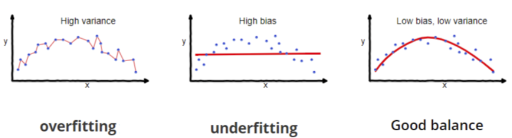
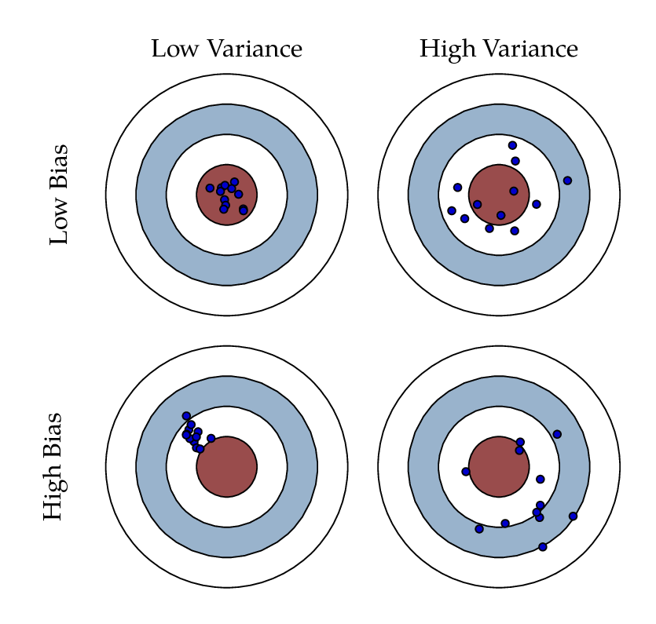
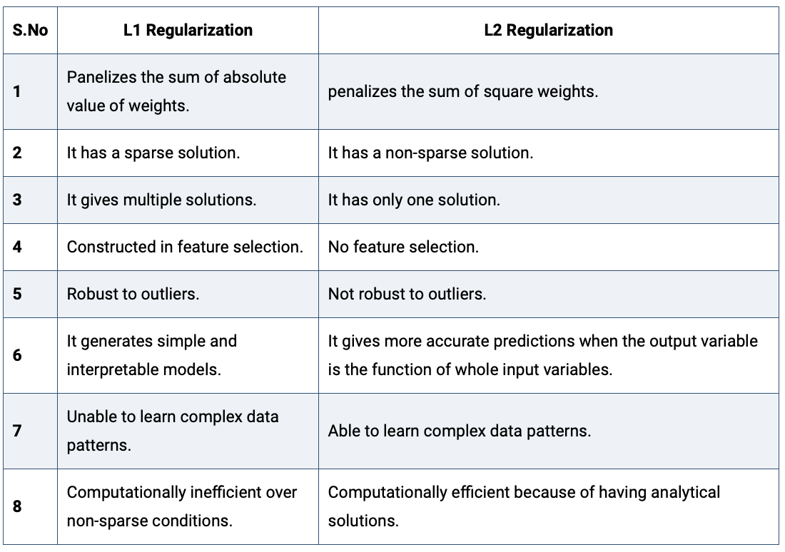

```{r setup, include=FALSE}
knitr::opts_chunk$set(echo = TRUE)
img_path <- "regfigs/"
```

## Bias-Variance tradeoff 
In statistics and machine learning, the **bias–variance tradeoff** is the property of a model that the variance of the parameter estimated across samples can be reduced by increasing the bias in the estimated parameters.

The **bias–variance dilemma** or **bias–variance problem** is the conflict in trying to simultaneously minimize these two sources of error that prevent supervised learning algorithms from generalizing beyond their training set

(Source: Wikipedia)

## Bias-Variance tradeoff 
The **bias** is an error from faulty assumptions or  mispecification of the learning algorithm. High bias can cause an algorithm to miss the relevant relations between features and target outputs (underfitting).

The **variance** is an error from sensitivity to small fluctuations in the training set. High variance may result from an algorithm modeling the random noise in the training data (overfitting).




## Bias-Variance tradeoff 
\center
{width=70%}

## Bias-Variance tradeoff 
The bias–variance tradeoff is a central problem in supervised learning. Ideally, one wants to choose a model that both accurately captures the regularities in its training data, but also generalizes well to unseen data. 

Unfortunately, it is typically impossible to do both simultaneously. High-variance learning methods may be able to represent their training set well but are at risk of overfitting to noisy or unrepresentative training data. In contrast, algorithms with high bias typically produce simpler models that may fail to capture important regularities (i.e. underfit) in the data.

(Source: Wikipedia)

## Regularization in Machine Learning
In regression analysis, the features are estimated using coefficients while modeling. In small sample sizes or noisy data coefficient estimates could be anecdotally incorrect (e.g., overfitting) or innacurate.  

If the estimates can be restricted, penalized, or shrunk towards zero, then the impact of insignificant features might be reduced and would prevent models from high variance with a stable fit.\footnote{Adapted from: https://www.analyticssteps.com/blogs/l2-and-l1-regularization-machine-learning}

## Regularization in Machine Learning

**Regularization** is the most used technique to penalize complex models in machine learning, it is deployed for reducing overfitting (or, contracting generalization errors) by putting small network weights into the model (adding a small amount of biad). Also, it enhances the performance of models for new inputs.\footnote{Source: https://www.analyticssteps.com/blogs/l2-and-l1-regularization-machine-learning}

Examples of regularization in machine learning, include:

* K-means: Restricting the segments for avoiding redundant groups.
* Neural networks: Confining the complexity (weights) of a model.
* Random forests: Reducing the depths of tree and branches (new features)

## Ridge regression
Ridge regression **regularizes** (shrinks) coefficients by imposing a penalty on 
their size. The ridge coefficients minimize a penalized sum of squared error: 
$$\hat\beta^{ridge}=\underset{\beta}\inf\left\{\sum_{i=1}^{N}(y_i-\sum_{j=1}^{p}x_{ij}\beta_j)^2+\lambda\sum_{j=1}^{p}\beta_j^2\right\},$$
where $\lambda\ge 0$ is a parameter that controls the shrinkage. The larger the value of $\lambda$ the more shrinkage  (towards 0). 


## Ridge regression
Or in matrix form, ridge regression minimizes:
$$\hat\beta^{ridge}=\underset{\beta}\inf\left\{({\bf y}-{\bf X}\beta)^T({\bf y}-{\bf X}\beta) + \lambda\beta^T\beta\right\}.$$
With a little work, the ridge regression solution can be shown to be: 
$$\hat\beta^{ridge}=({\bf X}^T{\bf X}+\lambda {\bf I}_N)^{-1}{\bf X}^T{\bf y}$$

## Ridge regression
The regularization for ridge regression, $\lambda\beta^T\beta$, is usually 
denoted as an **L2 regularization** or **L2 penalty**, as it adds a penalty which 
is equal to the square of the magnitude of coefficients. Both Ridge regression and 
Support Vector Machines (SVMs) implement this method.

L2 regularization can deal with multicollinearity problems (independent variables are highly correlated) through constricting the coefficient while keeping all the variables in a model. 

However, L2 regularization is not an effective method for selecting relevant
predictors (or removing redundant parameters). We will later use a **L1 regularization** for this purpose.
 

## Ridge regression: a Bayesian perspective
Ridge regression also has a clear Bayesian interpretation. It can be shown 
that the Ridge penalty can be interpreted as a 'zero' prior (Normal prior with 
zero mean), and the $\lambda$ is related to the variance of the prior.


## Lasso regression
Lasso (Least Absolute Shrinkage and Selection Operator) regression also **regularizes** coefficients by imposing a penalty on 
their size, but it uses an **L1** penalty. The lasso coefficients minimize the following cost function: 
$$\hat\beta^{lasso}=\underset{\beta}\inf\left\{\sum_{i=1}^{N}(y_i-\sum_{j=1}^{p}x_{ij}\beta_j)^2+\alpha\sum_{j=1}^{p}|\beta_j|\right\},$$
where $\alpha\ge 0$ is a parameter that controls the shrinkage. The larger the value of $\alpha$ the more shrinkage  (towards 0). 

## Lasso regression
Notice the similarity to the ridge regression problem: the L2 ridge penalty $\sum_{j=1}^{p}\beta_j^2$ is replaced by the L1 lasso penalty $\sum_{j=1}^{p}|\beta_j|$. 

This latter constraint makes the solutions nonlinear in the $y_i$, and there is no closed form expression for the lasso as was the case in ridge regression. 

Because of the nature of the constraint, making $\alpha$ sufficiently small will cause some of the coefficients to be exactly zero. Thus the lasso does a kind of continuous subset selection, or conducts a **variable selection**.

## Lasso vs Ridge regression
\center
{width=80%}

\scriptsize
([Elements of Statistical Learning](https://hastie.su.domains/Papers/ESLII.pdf), Hastie, Tibshirani, Friedman, by Springer)


## Lasso vs Ridge regression
\center
{width=85%}

\tiny
(https://www.analyticssteps.com/blogs/l2-and-l1-regularization-machine-learning)


## Elastic net regularization
Which should I choose? Ridge or Lasso? Well, why do I have to choose!

Instead use the **Elastic Net** that minimizes: 
$$\hat\beta^{elastic\ net}=\underset{\beta}\inf\left\{\sum_{i=1}^{N}(y_i-\sum_{j=1}^{p}x_{ij}\beta_j)^2+\alpha\sum_{j=1}^{p}|\beta_j|+\lambda\sum_{j=1}^{p}\beta_j^2\right\},$$
for some $\alpha\ge 0$ and $\lambda\ge 0$.

The quadratic penalty term makes the loss function strongly convex, and it therefore has a unique minimum. The elastic net method includes OLS, Lasso, and Ridge regression by setting either $\alpha=0$, $\lambda=0$, or both to 0. 


## Regression Regularization in R: glmnet
We can use the **glmnet** package to apply regularization in R: 

```{r, eval=F}
install.packages("glmnet")
```

The default model used in the package is the “least squares” regression model and glmnet actually optimizes: 
$$\hat\beta^{elastic\ net}=\underset{\beta}\inf\left\{\sum_{i=1}^{N}(y_i-\sum_{j=1}^{p}x_{ij}\beta_j)^2+ \lambda \left( \alpha\sum_{j=1}^{p}|\beta_j|+ (1-\alpha)\sum_{j=1}^{p}\beta_j^2 \right)  \right\},$$ 
with $\alpha=1$ as a default (so Lasso!).

## Regression Regularization in R: glmnet
Using the quick start example from the package:

```{r}
library(glmnet)
data(QuickStartExample)
x <- QuickStartExample$x
y <- QuickStartExample$y
```

## Regression Regularization in R: glmnet
We fit the model using the most basic call to glmnet.

```{r}
fit <- glmnet(x, y)
```

**fit** is an object of class glmnet that contains all the relevant information of the fitted model for further use. We do not encourage users to extract the components directly. Instead, various methods are provided for the object such as plot, print, coef and predict that enable us to execute those tasks more elegantly.

## Regression Regularization in R: glmnet
We can visualize the coefficients by executing the plot method:
```{r fig.height = 3, fig.width = 6, out.width="100%", fig.align="center"}
plot(fit)
```

## Regression Regularization in R: glmnet
A summary of the glmnet path at each step is displayed if we just enter the object name or use the print function:
\small
```{r}
print(fit)
```

## Regression Regularization in R: glmnet
We can obtain the model coefficients at one or more $lambda$’s within the range of the sequence:
```{r}
coef(fit, s = 0.1)
```

## Regression Regularization in R: glmnet
The function **glmnet** returns a sequence of models for the users to choose from. **Cross-validation** is perhaps the simplest and most widely used method to select a model. **cv.glmnet** is the main function to do cross-validation here, along with various supporting methods such as plotting and prediction.

```{r fig.height = 3, fig.width = 6, out.width="75%", fig.align="center"}
cvfit <- cv.glmnet(x, y)
plot(cvfit)
```

## Regression Regularization in R: glmnet
We can get the value of $\lambda_{min}$ and the model coefficients:
\tiny
```{r }
cvfit$lambda.min
coef(cvfit, s = "lambda.min")
```

## Example: Logistic Regression Elastic Net
Logistic regression is a widely-used model when the response is binary. Suppose the response variable $y$ takes values \{0,1\}. We model
$$P(y=1|{\bf X})=\frac{e^{{\bf X\beta}}}{1+e^{X\beta}},$$
which can be written in the following form:
$$\log\frac{P(y=1|{\bf X})}{P(y=0|{\bf X})}={\bf X}\beta,$$
the so-called “logistic” or log-odds transformation.

## Example: Logistic Regression Elastic Net
We seek to minimize the following loss function: 
$$\underset{\beta}\inf\left\{-\frac{1}{N}\sum_{i=1}^N y_i\log({\bf X}\beta)-\log\left(1+e^{{\bf X}\beta}\right)+ \lambda \left( \alpha\sum_{j=1}^{p}|\beta_j|+ (1-\alpha)\sum_{j=1}^{p}\beta_j^2 \right)\right\},$$
where the right hand side is the loss function for standard logistic regression, and the right hand side is the elastic net regularization.

Logistic regression is often plagued with degeneracies when $p>N$ and exhibits wild behavior even when $N$ is close to $p$; the elastic net penalty alleviates these issues, and regularizes and selects variables as well.

## Example: Logistic Regression Elastic Net
Using the example dataset from the glmnet package:

```{r}
library(glmnet)
data(BinomialExample)
x <- BinomialExample$x
y <- BinomialExample$y
```

## Example: Logistic Regression Elastic Net
Set family option to “binomial” in the glmnet function:
```{r}
fit <- glmnet(x, y, family = "binomial")
```

The code below uses misclassification error as the criterion for 10-fold cross-validation:
```{r }
cvfit <- cv.glmnet(x, y, family = "binomial", 
                   type.measure = "class")
```

## Example: Logistic Regression Elastic Net
Now we can plot the cross-validation results and find the 'best' $\lambda_{min}$:
```{r fig.height = 4, fig.width = 10, out.width="100%", fig.align="center"}
plot(cvfit)
cvfit$lambda.min
```

## Example: Logistic Regression Elastic Net
\tiny
```{r }
coef(cvfit, s = "lambda.min")
```

## Session Info
\tiny
```{r session}
sessionInfo()
```
